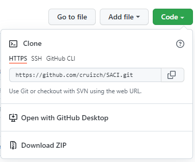
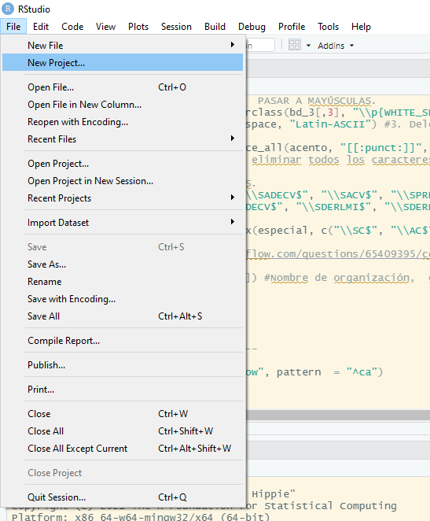
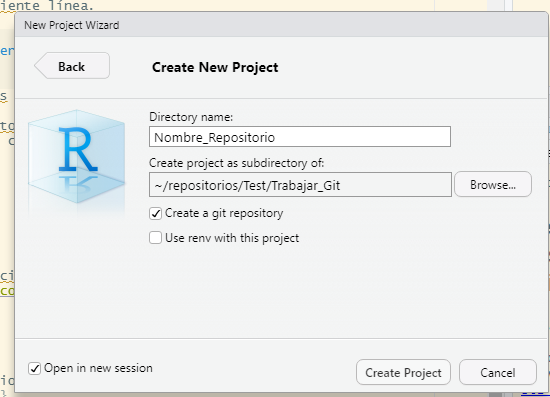
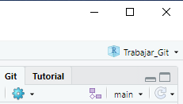
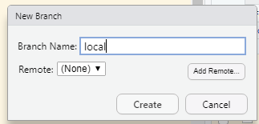

# Guía Básica para el uso de Git y GitHub 

>                                                  Gobierno de Datos

## Introducción

<p style="text-align:justify">Con el objetivo de facilitar el trabajo transparente y colaborativo entre los equipos de Gobierno de Datos, se ha generado esta guía para el uso de herramientas que permiten trabajar conservando un registro del control de versiones de proyectos en que participan varias personas Git y GitHub. Primero se muestran instrucciones sobre la instalación y posteriormente se explica cómo configurar e iniciar un proyecto desde RStudio.</p>

##
### GitHub

<p align="center">         

</p>

GitHub se nombra como la “plataforma de desarrollo de software líder en el mundo”, pues permite publicar, compartir y socializar (como una Red Social Digital) el código de programación. Además, permite registrar y ver cada cambio en el código y las carpetas que se ha hecho, permitiendo rastrear el progreso y, si es necesario, revertirlo (2019). 

#### Crear cuenta y repositorio

Acceder a este **[enlace](https://github.com/)** para crear una cuenta de GitHub.

1.- Una vez creada la cuenta, en la parte superior derecha de la página de Git Hub se observará un símbolo ' + '. 

2.- Debe abrir esa pestaña y de clic en "New Repository". 

3.- Ahora aparecerán las opciones de configuración donde tendrá la opción de agregar un documento README.md. 

4.- Listo, una vez seleccionadas las preferencias de configuración el nuevo repositorio se habrá creado.


### Instalación de Git en Linux, Windows y macOS

<p align="center">         

</p>

Git es un software cread por  **[Linus Torvals](https://es.wikipedia.org/wiki/Linus_Torvalds)** diseñado para mejorar la eficiencia, confiabilidad y compatibilidad de versiones de aplicaciones cuando están compuestas por un gran número de código fuente y participan vari@s desarrollador@s simultáneamente (**[Wikipedia](https://es.wikipedia.org/wiki/Git)**, **[Git](https://git-scm.com/)** ).

Con esta herramienta es posible actualizar el código desarrollado de manera colaborativa conservando un registro y control de versiones.


Para descargar el archivo de instalación de Git acceder a este **[enlace](https://git-scm.com/downloads)**.

Sobre la instalación, las opciones predeterminadas permitirán el funcionamiento adecuado de Git en tu computadora.

Como recomendación, se podrá crear una carpeta "repositorio" en la siguiente ubicación:
```
C:/Usuarios/<nombre de usuario>/Documents/<repositorio_nuevo>
```

En esta ubicación se generará el repositorio que podrá usarse en el futuro. Una vez instalado Git, se deben de seguir los siguientes pasos para copiar un repositorio. Como amigable recordatorio, la forma de correr una línea de código generalmente es pulsando **Ctrl + Enter**. Y el primer paso es Abrir Git Bash y escribir:

-  cd Documents/repositorio_nuevo 

Lo anterior agrega la carpeta *nuevo_repositorio* a git, reconociéndola como repositorio. Posteriormente, para clonar el repositorio de GitHub:

- <code> git clone URL </code>

Donde ***URL*** es el enlace para clonar desde la página de GitHub. 


#### Autenticación 

Para vincular un repositorio de GitHub a RStudio desde Git, será necesario el enlace del repositorio en que se quiera trabajar. Se explicará cómo usar este enlace en una etapa posterior.

A este procedimiento se le conoce como autenticación. Es importante mencionar que, exiten dos opciones para vincular un repositorio. Es posible usar el formato de HTTPS o SSH los cuales tienen las siguientes características.

Se sugiere que el usuario emplee el protocolo HTTPS, por su eficiencia y facilidad. 


- *HTTPS*:
    Si se elige el formato HTTPS, esto le permitirá usar un administrador de credenciales para almacenar en memoria cahé las credenciales de GitHub en Git.   
	Para seguir este protocolo se sugiere seguir lo siguientes pasos, retomados por la guía oficial de GitHub: 
	
	1. Instalar GitHub CLI
	2. En la terminal de GitBash, escribir <code> gh auth login </code> y seguir las instrucciones.

- *SSH*:
    Al elegir la opción SSH, será necesario crear claves SSH en cada ordenador que use para su proyecto, ya sea para enviar o extraer información del repositorio en GitHub. Para establecer la configuración SSH o cambiar de HTTPS a SSH puede consultar el siguiente **[enlace](https://docs.github.com/es/get-started/getting-started-with-git/managing-remote-repositories#switching-remote-urls-from-https-t)**.

Para obtener el link HTTPS o SSH debes dirigirte a tu repositorio en GitHub y dar clic al botón verde "Code".

<p align="center">         

</p>

*Más información puede consultarse en el siguiente*  **[enlace](https://docs.github.com/en/get-started/quickstart/set-up-git)**.

##  Trabajar con Git desde  Git Bash


### Configutación

Para vincular Git con tu cuenta de GitHub es necesario agregar tus credenciales:

- <code> git config --global user.name <Nombre de usuario>   </code>

	
- <code> git config --global user.email <Cuenta de correo electrónico>   </code>

Al abrir Git Bash, seleccionar el repositorio o carpeta donde se encuentren los archivos que se desean actualizar:

- <code>  cd  / Documents/nuevo_repositorio </code>


-  <code>  git add nombre_archivo </code>

#### Actualización o descarga de repositorio local

Para estar al tanto de los cambios que se han realizado en el repositorio de GitHub se debe hacer una actualización de los cambios realizados en la nube. Por otro lado, cuando se quiere subir cambios a una rama, antes de subir los cambios (push) se debe actualizar, ya que en caso de que haya cambios no registrados en el repositorio local podría haber un error y no ejecutar la función push.

Procedimiento:


- <code> git pull --verbose </code>


#### Publicar cambios en el repositorio remoto GitHub

Para agregar las modificaciones realizadas a todos los archivos contenidos en el repositorio local se debe seguir el siguiente procedimiento. Sin embargo, se recuerda que antes de publicar cambios, es necesario trabajar sobre el archivo. Esto se puede ver en la sección de Uso de RStudio para clonar). 
 
- <code> git add . </code>
- <code> git commit -m "Agregar un mensaje sobre la actualización realizada " </code>
- <code> git push </code>


### Publicar cambios en un solo archivo

Si se requiere publicar los cambios realizados en un solo archivo del repositorio el procedimiento es el siguiente:


- <code> git add nombre_archivo.extensión  (Ejemplo: git add abc.txt) </code>
- <code> git commit -m "Mensaje sobre la actualización realizada" </code>
- <code> git push </code>


### Comandos Git

Para facilitar el uso de Git y resolver posibles dificultades con el uso de funciones se agrega una sección con los comandos Git y sus funciones más utilizadas.

<table>
  <caption> <centre>                       Comandos básicos Git </centre></caption>
  <thead>
    <tr>
      <th>Código</th>
      <th>Uso</th>
    </tr>
  </thead>
  <tbody>
    <tr>
      <td> git clone URL </td>
      <td>  Descargar un repositorio existente </td>
    </tr>
    <tr>
      <td> git branch brnach_name </td>
      <td>  Crear nuevo Branch  </td>
    </tr>
    <tr>
      <td> git branch --list </td>
      <td> Visualizar Branch existentes </td>
    </tr>
    <tr>
      <td> git branch -d branch_name </td>
      <td> Eliminar Branch </td>
    </tr>
    <tr>
      <td> git checkout name_of_your_branch </td>
      <td> Para cambiar de una rama a otra (1) </td>
    </tr>
    <tr>
      <td> cd carpeta/ <p> rm - rf .git </p>  </td>
      <td> Eliminar un repositorio local </td>
    </tr>
    <tr>
      <td> git rm -r --cached directorio </td>
      <td> Eliminar repositorio y contenido </td>
    </tr>
    <tr>
      <td> git rm archivo </td>
      <td> Eliminar un archivo en particular </td>
    </tr>
</table>


(1) Para usar este comando, previamente hay que verificar o guardar los cambios en la rama actual. La rama que se desea verificar debe estar en su repositorio local.

En caso de querer profundizar en el manejo de esta herramienta y sus comandos avanzados, te sugerimos descargar la guía oficial de Git a través del siguiente link [Downloads](https://git-scm.com/book).
            

# Vincular Git con Rstudio
<p align="center">         

</p>

## Instalar R y RStudio

Antes de tener RStudio, se debe de instalar previamente R. Esto se puede consultar aquí:  [Descargar_R](https://cran.r-project.org/bin/windows/base/)
Sobre las opciones de configuración, las que están predeterminadas permitirán el funcionamiento adecuado. Además, para conoce qué versión de R descargar, sea de 32 o de 64 bits, puede verificar siguiendo estos pasos: 

1. Ingrese a **Configuración** de su ordenador

2. Seleccione **Sistema**

3. Pinche en **Acerca de...**

4. Visualice la opción de **Tipo de Sistema**. Ahí se identifica si es de 32 o 64 bits. 

Una vez que se tiene R, es posible descargar RStudio desde aquí: [Descargar_RStudio](https://www.rstudio.com/products/rstudio/download/#download)

### Preparar RStudio 
<p align="center">         

</p>

Para poder vincular GitHub con RStudio es necesario hacer un procedimiento. 

0. Abrir Rstudio. 

1. Ingresar la siguientes línes de código dentro del ***R Script*** (es decir, en la sección superior izquierda)

<code>
install.packages("usethis")
library(usethis)
</code>

2. Escribir su nombre de usuario y correo que usó para generar la cuenta en GitHub en la siguiente línea de código. 

<code>
usethis::use_git_config(user.name = "Tu_nombre_Usuario_GitHub", user.email = "tucorreo@correo.com")
</code>

Recuerde reemplazar por los datos correctos del usuario. 

Se sugiere que en este punto se tenga una cuenta de GitHub y un repositorio. Si no es así, puede ir a la sección sobre ***Crear cuenta y repositorio en GitHub***, de este documento. 

#### Uso de RStudio para clonar

Para Vincular RStudio al proyecto en GitHub, es necesario seguir las siguientes instrucciones. Si se desea conocer más sobre la vinculación de Git y  RStudio, se sugiere hacer click en la versión [extendida](https://cfss.uchicago.edu/setup/git-with-rstudio/).


1. Hacer clic en *”Files”*, luego *”New Project”*. 

<p align="center">         

</p>

2. Dar clic en *“New Directory”*, posteriormente verá un listado de opciones, selecciones *“New Project”*. Se abrirá una imagen relativa a crear un proyecto nuevo.

<p align="center">         

</p>


3. Una vez en la pestaña que se muestra, escriba el nombre del Directorio, haga match en *“Create a git repository”* y se sugiere *“Open in new session”*.

4. Para terminar, cerramos el proyecto desde *File -> Close Project* antes de apagar RStudio a fin de evitar errores al recargar la interfaz en otra ocasión.


## Trabajar en RStudio desde una rama local 

Para evitar problema al trabajar colaborativamente, tales como actualizaciones mietras se está trabajando sobre un repositorio, o dificultades al unir dos nuevas actualizaciones, se sugiere trabajar desde una **rama local**. También se sugiere seguir estos pasos, una vez que se sienta cómoda o cómodo trabajando en el entorno de Git y de RStudio. 


1. ***Importante*** Se pinche en el símbolo morado para crear una rama local en la cual trabajaremos.
<p align="center">         

</p>

La cual se configura únicamente para trabajar de manera local como se muestra en la siguiente imagen.  

<p align="center">         

</p>


Este paso se realiza para evitar problemas cuando haya cambios en la rama principal <code> main</code> . De preferencia, se hace esta acción cada vez que inicie un nuevo proyecto. Para evitar errores más adelante, el nombre de la rama no debe contener símbolos especiales, ni puntos, ni acentos ni espacios: se sugiere usar un nombre del tipo <code> rama_local </code> o bien <code> local </code>.

2. Se trabaja normalmente, y se realizan todas las acciones y actualizaciones dentro de esta rama local.

3. Se pincha  <code> Commit</code> dentro de la pestaña *Git* y escribe los comentarios necesarios para explicar nuestro trabajo realizado en la ventana que se abre. Asegúrese de seleccionar solo los archivos que deseemos actualizar.

4. Junto al nombre de la rama local <code>rama_local</code> en la pestaña *Git* aparece un triángulo que apunta hacia abajo, se pinche y se cambia a la rama principal <code>main</code> Esto abre un mensaje que, si no hay errores, indicará que ha cambiado a la rama principal.

5. Nuevamente se realiza <code>pull</code> porque podría haber actualizaciones realizadas por otro colaborador.

6. En caso de que haya actualizaciones después de *descargar* la última versión del repositorio, nuevamente se hace <code> Commit </code>.  Note que ya se encuentra en la rama principal <code> main</code> del proyecto

7. Se abre una consola a partir del menú <code> Tools -> Shell </code>

8. En la consola se escribe el siguiente comando: <code> git merge rama_local </code> donde <code> rama_local </code> es el nombre que se asignó a la rama local en la cual se trabajó. Esto se hace para *combinar* el trabajo local con la rama principal <code> main </code>  antes de subir las actualizaciones al repositorio. Se cierra la consola.

9. A continuación, se hace <code> push </code> del trabajo. Esto se logra pinchando la flecha verde que apunta hacia arriba. Esto actualización el repositorio.

10. Se elimina la *rama local* al escribir en la consola el siguiente comando: <code> git branch -d rama_local</code> . Una vez hecho esto, se cierra la consola. 

11. Para concluir, se cierra el proyecto desde <code> File -> Close Project </code> antes de cerrar RStudio para evitar errores al cargar la interfaz en una próxima ocasión.

12. Cuando se reabra el proyecto una próxima vez, se puede comenzar desde acceder a una ***rama local***. Disfrute :Happy_face: 


## Sugerencias para el uso de R Markdown 

<p align="center">         

</p>

- *Para tener mayor documentación conservamos las sugerencias de RStudio: <http://rmarkdown.rstudio.com>.*
